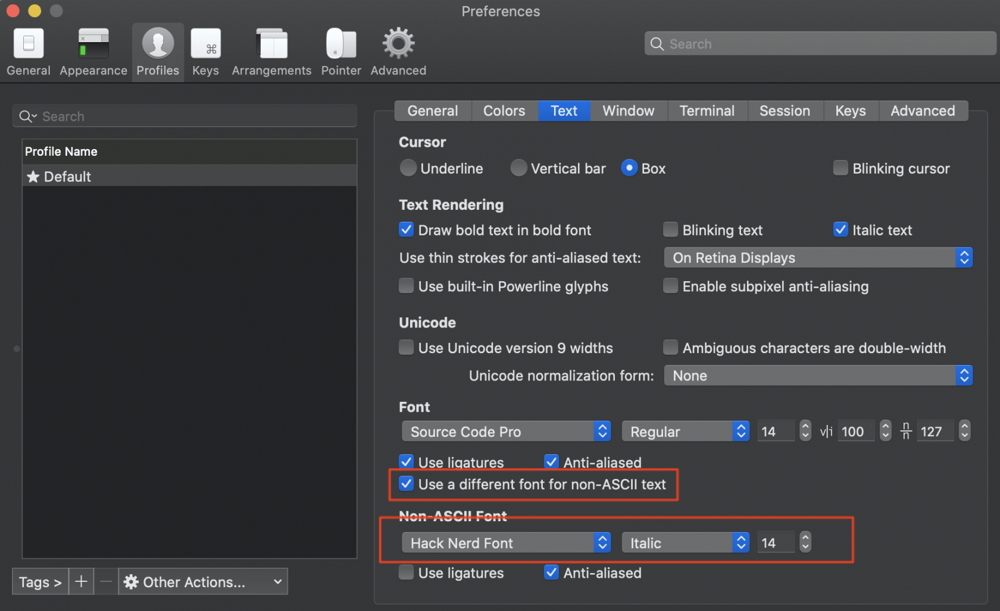

# README

# 0x01. defx-icon
## Install font

```bash
brew tap homebrew/cask-fonts
brew cask install font-hack-nerd-font
```



# 0x02. Markdown

```bash
#install grip
brew install grip
```

- <c-m> Open chrome to preview
- Generate html when you save file (:w)

# 0x03. zshrc
Maintain one copy of .zshrc on git, so you should remove the local one and link to this new one.

```bash 
rm ~/.zshrc
ln -s ~/.config/nvim/iterm2/.zshrc ~/.zshrc
```
